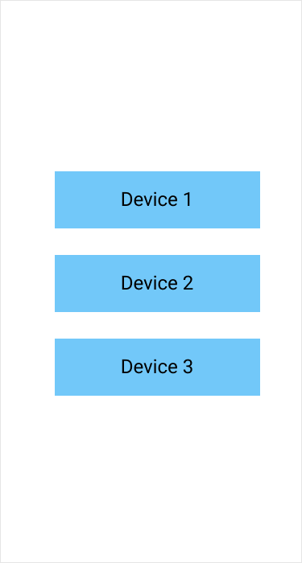
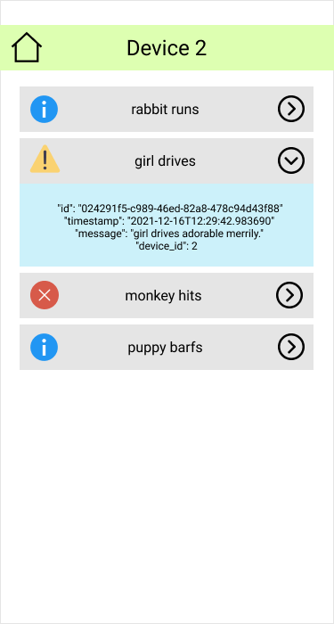

# Backend сервер для тестового задания на Frontend разработчика

## Тестовое задание

Написать двухстраничное приложение.

На первой странице необходимо вывести список устройств, который backend выдаёт по GET запросу.



По клику на устройство совершается переход на вторую страницу, где для текущего устройства нужно в реальном времени отображать события, которые приходят по websocket в json формате.



В основной информации нужно отобразить иконку event_type, краткое сообщение (первые два слова от полного) и состояние элемента (развёрнут или свёрнут). При нажатии на событие, должна раскрыться дополнительная информация, как в примере выше. По нажатии на иконку домой, нужно вернуться на первый экран и закрыть приём сообщений от устройства.

> Интерфейс должен прежде всего хорошо отображаться на мобильных устройствах, но будет плюсом, если он также будет разумно смотреться и на десктопе.

## Запуск backend сервера

Сервер запускается любым способом из представленных ниже.


По умолчанию сервер запускается на `http://localhost:8000`.

OpenAPI документация доступна на `http://localhost:8000/docs`.

### Python

```bash
pip install -r requirements.txt
uvicorn app:app
```

### Docker

```bash
docker-compose build
docker-compose up
```

## Эндпоинты

### `GET /`

Перенаправляет на `/docs`

### `GET /devices`

Выдаёт список устройств ([[Device]](#device))

> Внимание!
>
>
> Каждый запрос к `/devices` выдает рандомное число
> количество устройств, обновляя допустимые
> пути для запросов `/ws/telemetry/{device_id}` и
> `/test/telemetry/{device_id}`

### `WebSocket /ws/telemetry/{device_id}`

Открывает сокет, по которому передаются сообщения телеметрии ([TelemetryMessage](#telemetrymessage)) в формате `JSON`.

Если соответствующего `device_id` не существует, сокет закрывается с кодом `404`.

### `GET /test/telemetry/{device_id}`

Эндпоинт для отладки клиента.
Возвращает одно сообщение телеметрии ([TelemetryMessage](#telemetrymessage)) с указаного устройства, если оно существует

## Модель данных

### Device

Устройство

| Поле | Тип | Описание |
| :--- | :-- | :------- |
| `id` | `int` | ID устройства |
| `name` | `str` | Имя устройства |

### TelemetryMessage

Сообщение телеметрии

| Поле | Тип | Описание |
| :--- | :-- | :------- |
| `id` | `str` | Идентификатор сообщения (`uuid4`) |
| `device_id` | `int` | Идентификатор устройства, с которого поступило событие |
| `timestamp` | `datetime` | дата события в формате `ISO 8601` |
| `event_type` | `enum` | Тип события (`"INFO"`, `"WARNING"` или `"ERROR"`) |
| `message` | `str` | Сообщение телеметрии |